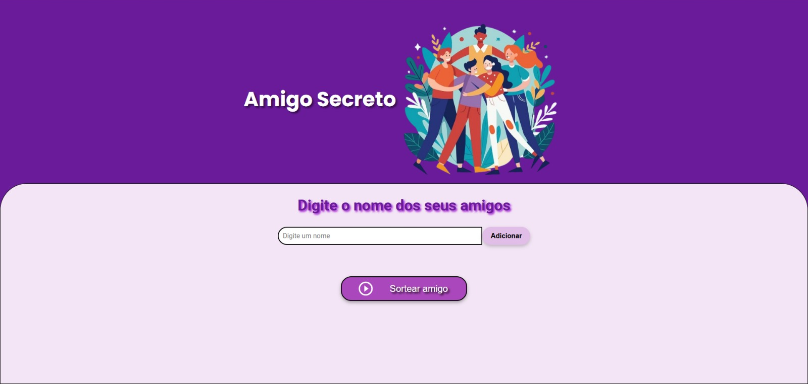
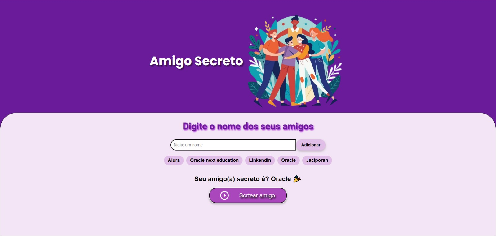

# Amigo Secreto 🎉

Um aplicativo interativo para realizar sorteios de "Amigo Secreto" de forma rápida e divertida. Ideal para festas, encontros entre amigos ou eventos corporativos.

---

## 🎯 Objetivo

O objetivo deste projeto é criar uma experiência intuitiva e moderna para realizar sorteios de Amigo Secreto, garantindo que os resultados sejam exibidos de maneira dinâmica e responsiva.

---

## 🚀 Funcionalidades

- **Adicionando Participantes**: Insira os nomes dos amigos de forma prática e visualize a lista atualizada automaticamente.
- **Sorteio Aleatório**: Cada participante pode visualizar seu amigo secreto, garantindo surpresas.
- **Interface Agradável**: Um design limpo, responsivo e fácil de usar.
- **Mensagens Dinâmicas**: Apresentação animada do resultado com mensagens de transição entre sorteios.

---

## 🛠️ Tecnologias Utilizadas

- **HTML5**: Estrutura semântica da aplicação.
- **CSS3**: Estilização responsiva com cores modernas e animações.
- **JavaScript**: Lógica do sorteio e interações dinâmicas com o usuário.

---

## 📂 Estrutura do Projeto

- `index.html`: Arquivo principal que estrutura a interface.
- `style.css`: Estilização responsiva e personalizada do projeto.
- `app.js`: Contém a lógica para gerenciar participantes e realizar os sorteios.
- `assets/`: Contém as imagens usadas no projeto.

---

## 📋 Como Utilizar

1. Clone este repositório:
   ```bash
   git clone https://github.com/JaciporanVieira/Challenge-Amigo-Secreto
   ```
2. Navegue até o diretório do projeto:
   ```bash
   cd Challenge-Amigo-Secreto
   ```
3. Abra o arquivo `index.html` em seu navegador.
4. Digite os nomes dos participantes e clique em "Adicionar".
5. Quando todos os nomes forem adicionados, clique em "Sortear amigo" para iniciar o sorteio.

---

## 💡 Melhorias Aplicadas

- Implementação de restrições para evitar que alguém tire a si mesmo como amigo secreto.
- Integração com banco de dados para persistir participantes e resultados.
- Opção de exportar os resultados em PDF ou compartilhá-los diretamente via e-mail.

---

## 👨‍💻 Desenvolvedor

**Jaciporan Vieira**

- [GitHub](https://github.com/JaciporanVieira)
- [LinkedIn](https://www.linkedin.com/in/jaciporan-vieira)

---

## Capturas de Tela 🖼️

1. **Tela Inicial**  
   !

2. **Sorteio Realizado**  
   

---

## 📄 Licença

Este projeto está sob a licença MIT. Consulte o arquivo `LICENSE` para mais detalhes.

---


